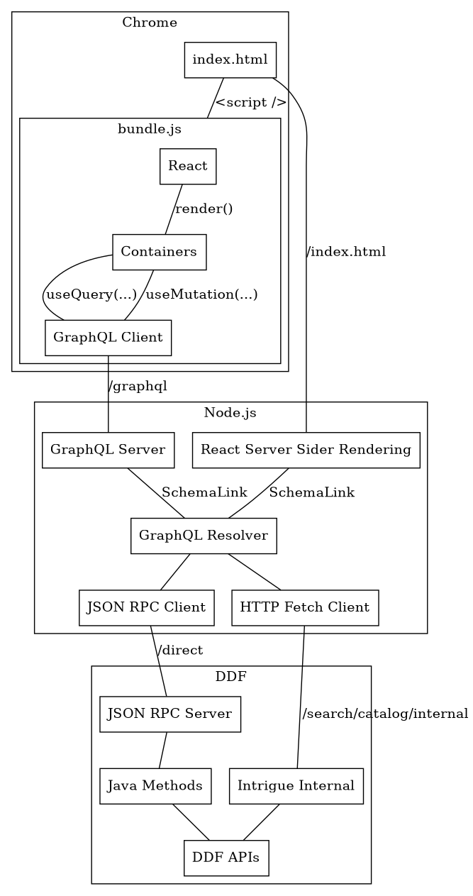

# Architecture

The sections below describe all the components in the above diagram and
what purpose they serve.

## GraphQL API

GraphQL is our Backbone replacement as it takes over network
synchronization and communication. We have chosen to use the [Apollo
GraphQL](https://www.apollographql.com/) library as it is a popular and
mature GraphQL implementation. On top of being a replacement, we get
additional leverage which will be describe below.

### Declarative Data Fetching

Getting data from the backend should be as easy as saying **I require this
information** and waiting for the data to get to your component. With
[@apollo/react-hooks](https://www.apollographql.com/docs/react/api/react-hooks/)
we can leverage
[`useQuery`](https://www.apollographql.com/docs/react/api/react-hooks/#usequery)
to get that exact behavior.

### Transparent Network Optimization

- [Caching](https://www.apollographql.com/docs/apollo-server/performance/caching/)
- [Batching](https://www.apollographql.com/docs/link/links/batch-http/)
- [Automatic persisted queries](https://www.apollographql.com/docs/apollo-server/performance/apq/)

### Decoupling the System

Another motivating factor for GraphQL is decoupling the frontend from the
backend. Third-party services can be accessed in the same way from the
perspective of the UI. It is all presented in terms of queries and
mutations.

### Automatic Documentation

To play with the GraphQL API, just hit the [GraphQL
Playground](http://localhost:8080/graphql).

### Server Side Rendering (SSR)

Server side rendering is a technique where client initialization code like
data fetching and rendering can be run server side before a page loads.
The result is a more meaningful first paint to the user. It also allows us
to prime the application cache reducing the number of immediate requests
on page load.

A key enabler for SSR is GraphQL as the `useQuery` hook declaratively
annotates react components with data dependencies. This allows for
seamless data fetching without any boilerplate.

To keep seamless support for SSR, the UI should **only communicate with
the rest of the system via GraphQL**.

## DDF [JSON RPC](https://www.jsonrpc.org/specification) API

This part of the system is intended to expose DDF capabilities to the
network. It should have the following properties:

- **Direct.** No embedded Intrigue specific business logic, just
  **expose** DDF APIs.
- **Simple.** Methods should do one thing and let consumers compose
  methods together to enable more complex behaviors.
- **Transport agnostic.** Should be independent of HTTP as it allows us to
  run the API over multiple transports (HTTP/WS/...).
- **Batchable.** [batching](https://www.jsonrpc.org/specification#batch)
  to enable more efficient communication when possible.
- **Documented.** The [list-methods](https://localhost:8993/direct) rpc
  method should list out all known methods.
